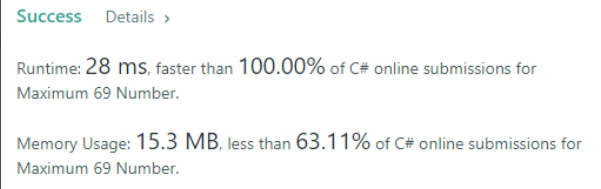

# C# - 100 days of code

## Day18. [LeetCode-#237] Delete Node in Linked List
由於已經先給定了要刪除的 node 不能是 tail node 的先決條件, 所以這題實在有點讓人摸不著頭緒, 如果想的複雜一點反而還可能出錯。:sob:

#### .Net Core Template:
*Console App*

#### Step by Step
1. Node value is NextNode value
2. Node next is NextNode next 

#### Code
    public void DeleteNode(ListNode node) {
        node.val = node.next.val;
        node.next = node.next.next;
    }

#### Reference: [What is ListNode in C# ?](https://www.reddit.com/r/csharp/comments/f4im6c/what_is_listnode_in_c/)

## Day17. DOCX to HTML
今天使用 Aspose.Words for .NET API, 程式碼的部分也很簡單。 

#### .Net Core Template:
*Console Application*

#### Overview

#### Step by Step
1. Install nuget package
2. Set Directory path
3. Load DOCX file
4. Initialize HtmlSaveOptions
5. Convert DOCX to HTML

#### Code
    static void Main(string[] args)
    {
        string dataDir = "\\Documents\\C#\\myProject\\100DaysOfCode\\FileConversion\\Files\\";
        // Load the document from disk.
        Document doc = new Document(dataDir + "test.docx");

        // Set HtmlSaveOptions
        HtmlSaveOptions options = new HtmlSaveOptions();
        options.SaveFormat = SaveFormat.Html;

        // Save the document into HTML
        doc.Save(dataDir + "Document.html", options);
    }

#### References
1. [Convert Word DOC or DOCX to HTML, MHTML in C# VB.NET](https://blog.aspose.com/2020/10/02/convert-word-doc-or-docx-to-html-mhtml-csharp-vb-net/)
2. [Aspose.Words 20.12.0 (Nuget)](https://www.nuget.org/packages/Aspose.Words/)
3. [Sample .doc and .docx download](https://file-examples.com/index.php/sample-documents-download/sample-doc-download/)

## Day16. [LeetCode-#670] Maximum Swap
找出轉換後最大的數且只有一次轉換的機會, 那就必須能知道當前的數字是否已經是最大的數。在判斷的過程中如果確認已經找到是最大的數, 則會 Swap two number 並且回傳轉換後的值。

#### Step by Step
1. Convert integer to string
2. Convert string to char array
3. Check if the length of the array is greater than 1 

#### Code
    public int MaximumSwap(int num) {
        string s = Convert.ToString(num);
        char[] ch = s.ToCharArray();
        
        if(ch.Length > 1)
        {
            for (int i = 0; i < ch.Length-1; i++)
            {

                if(ch[i] != '9'){
                    int n = i;
                    for(int j = i + 1; j < ch.Length; j++)
                    {
                        if(ch[i] < ch[j] && ch[j] >= ch[n])
                        {
                            n = j;
                        }

                    }
                    if(n != i)
                    {
                        char[] ch1 = new char[1];
                        ch1[0] = ch[i];
                        ch[i] = ch[n];
                        ch[n] = ch1[0];

                        goto end;
                    }
                }
            }
            end:
            string s2 = new string(ch);
            int parsed = Convert.ToInt32(s2);
            return parsed;

        }
        else
        {
            return num;
        }
    }

## Day15. [LeetCode-#344] Reverse String
即使這題只要使用 Array.Reverse 方法就能夠很輕易地解決, 我還是有想出自己的解法。 我的方式是使用 Swap two nubmers 結合 for loop 做左右互換, 而 for loop 只要執行 array s 長度的一半即可。 

#### Step by Step
1. Declare a one-dimensional char array c
2. Reverse the char array s using for loop (half of array)

#### Code
    public void ReverseString(char[] s) {
        char[] c = new char[1];
        for (int i = 0; i < (s.Length) / 2; i++)
        {
            c[0] = s[i];
            s[i] = s[s.Length - 1 - i];
            s[s.Length - 1 - i] = c[0];
        }
    }

#### Reference: [Array.Reverse Method](https://docs.microsoft.com/en-us/dotnet/api/system.array.reverse?view=net-5.0)

## Day14. [LeetCode-#1323] Maximum 69 Number
由左至右, 將發現的第一個 6 替換成 9, 結束。 

#### Faster than 100% :tada::tada::tada::tada::tada:
 

#### Step by Step
1. Convert integer to char array
2. Find and place digit 6 to 9
3. Convert char array to string
4. Convert string to integer

#### Code
    public class Solution {
        public int Maximum69Number (int num) {
            char[] arr = num.ToString().ToCharArray();
            for (int i=0; i < arr.Length; i++)
            {
                if (arr[i] == '6')
                {
                    arr[i] = '9';
                    break;
                }
            }
            string str = new string(arr);
            int x = Int32.Parse(str);
            return x;
        }
    }

## Day13. [LeetCode-#136, #287] Single Number, Find the Duplicate Number
今天這兩題的作法都是先將陣列進行排序, 在判斷是否和下一位數相同或是相異。如果能找出 Single Number, 那一定也能找出 Duplicate Number。

#### Step by Step (#136)
1. Sorting array
2. Find the single number

#### Code(#136)
    public int SingleNumber(int[] nums) {
        // Sorting array
        Array.Sort(nums);

        for (int i = 0; i < nums.Length; i++)
        {
            if (i == ( nums.Length - 1))
            {
                return nums[i];
            }
            else
            {
                // Find the single number
                if (nums[i] != nums[i + 1] && ((i + 1) % 2) == 1)
                {
                    return nums[i];
                }
            }
        }
        return 1;
            
    }

#### Reference: 
1. [Different ways to sort an array in descending order in C#](https://www.geeksforgeeks.org/different-ways-to-sort-an-array-in-descending-order-in-c-sharp/#:~:text=Method%201%3A%20Using%20Array.Sort,and%20Array.Reverse()%20Method&text=Sort()%20method%20which%20sorts,Reverse()%20method.&text=int%20%5B%5D%20arr%20%3D%20new%20int,Sort%20array%20in%20ascending%20order.)

2. [What is the difference between & and && operators in C#
](https://stackoverflow.com/questions/4163483/what-is-the-difference-between-and-operators-in-c-sharp)

## Day12. [LeetCode-#709, #190] To Lower Case, Reverse Bits
第一題算是非常簡單的題目, 只需要使用.ToLower() 就能完成。
第二題則複雜很多, 第一步會先將 Unsigned integer 轉換成一個 Binary string, 再使用 PadLeft() 以 '0' 填充 Binary string 左邊空格的部分, 填充後再將這個 Binary string 轉換成一個 char array。 當然, 這題最主要的還是要進行 Reverse bits, 最後使用了一個 for loop 結合 swap 的方式進行轉換。

#### Step by Step (#190)
1. Convert uint to binary string
2. Pad the  binary string with leading zeros
3. Convert to char array
4. Reverse bits

#### Code(#190)
    public uint reverseBits(uint n) {
        string binary = Convert.ToString(n, 2);
        char[] ch = binary.PadLeft(32, '0').ToCharArray();
        char[] c = new char[1];
        for (int i=0; i < 16; i++)                         // 左右互換
        {
            c[0] = ch[i];
            ch[i] = ch[31-i];
            ch[31-i] = c[0];
        }
        string s = new string(ch);
        uint parsed = Convert.ToUInt32(s, 2);
        return parsed;
    }

## Day11. [LeetCode-#1] Two Sum
這題算是蠻簡單的, 只要使用兩個 for loop 就能找出組成 target 的兩個數。

#### Code:
    public static int[] TwoSum(int[] nums, int target)
    {
        for (int i = nums.Length - 1; i >= 0; i--)
        {
            for (int j = 0; j <= i - 1; j++)
            {
                if (nums[j] + nums[i] == target)
                {
                    int[] num = { j, i };
                    return num;
                }
            }

        }
        return null;
    }

## Day10. [LeetCode-#191] Number of 1 Bits

#### Step by Step
1. Convert uint to string
2. Convert string to char array
3. Foreach char array and count the number of 1s

#### Code:
    public int HammingWeight(uint n) 
    {
        string s = Convert.ToString(n, 2); // Convert uint ot string
        char[] ch = s.ToCharArray();       // Convert string to char array
        int num = 0;              
        foreach (char c in ch)             // Foreach char array and count the number of 1s
        {
            if(c == '1')
            {
                num = num + 1;
            }
        }
        return num;
    }

## Day9. Windows Form CRUD Operations (2)
延續昨天未完的部分

## Day8. Windows Form CRUD Operations (1)
今日參考 Youtube 上的教學影片建立 Windows Form App, 主要功能是對於 SQL Server 的資料進行 CRUD Operations, 未完的部分明天繼續

#### .Net Core Template:
*Windows Form App*

#### Step by Step

#### Features

#### Code

#### References:  
1. [C# and SQL Server Perform SMART CRUD Operations with SEARCH (Edited Version Part 1/2)](https://www.youtube.com/watch?v=mw4TmD2AMtA)
2. [C# and SQL Server Perform SMART CRUD Operations with SEARCH (Edited Version Part 2/2)](https://www.youtube.com/watch?v=iqT0e09JCXQ)

## Day7. Digital Clock

#### Step by Step
* Download DS-Digital font
* Create Windows Form app
* Change background
* Add Labels
* Add button
* Change font
* Coding
#### Code
    private void timer1_Tick(object sender, EventArgs e)
    {
        <!-- Formatting times -->
        label1.Text = DateTime.Now.ToString("dddd");
        label2.Text = DateTime.Now.ToString("HH:mm");
        label5.Text = DateTime.Now.ToString("tt");
        label4.Text = DateTime.Now.ToString("yyyy");
        label3.Text = DateTime.Now.ToString("ss");
        label6.Text = DateTime.Now.ToString("MMM:dd");

    }
    private void Form1_Load(object sender, EventArgs e)
    {
        <!-- start a timer -->
        timer1.Start();
    }
    private void button1_Click(object sender, EventArgs e)
    {
        <!-- Exit the application -->
        Application.Exit();
    }

#### Referencee: [Make Digital Clock using C# Visual studio basics](https://www.youtube.com/watch?v=OFQxQndIFrQ)

## Day6. Multiplication table
參考網路資料後加入了標題以及輸入功能

#### Reference: [Multiplication tables](https://rosettacode.org/wiki/Multiplication_tables)

## Day5. DBConnection
SQL Server 連線測試程式。

#### Reference:
1. [Beginners guide to accessing SQL Server through C#](https://www.codeproject.com/Articles/4416/Beginners-guide-to-accessing-SQL-Server-through-C))
2. [How to check MySQL connection state in C#](https://stackoverflow.com/questions/20785220/how-to-check-mysql-connection-state-in-c-sharp/20785451)

## Day4. Elementary Arithmetic
簡易四則運算

## Day3. Signature pad (1)
參考網路文章建立簽名板, 因為程式中有些地方還需要進行除錯。

#### Reference: [Register Account with Digital Signature in ASP.NET Core MVC](https://www.youtube.com/watch?v=NUrpve7hXuM)

## Day2. CRUD with search
今天參考的是這篇 [How to Upload Files and Save in Database in ASP.NET Core MVC](https://tutexchange.com/how-to-upload-files-and-save-in-database-in-asp-net-core-mvc/), 文章寫得非常詳細, 只要按照他的步驟就能夠成功將檔案存入資料庫中。

#### .Net Core Template
*Windows Form*

#### Overview

## Day1. File management
第一天, 今天參考 Tim Corey 的影片 [Working With The File System in C# - Managing Folders and Files](https://www.youtube.com/watch?v=9mUuJIKq40M), 學習如何對檔案進行存取。主要使用到 System.IO 的 [Directory](https://docs.microsoft.com/en-us/dotnet/api/system.io.directory?view=net-5.0) 類別。

#### .Net Core Template
*Console Application*

#### Overview

