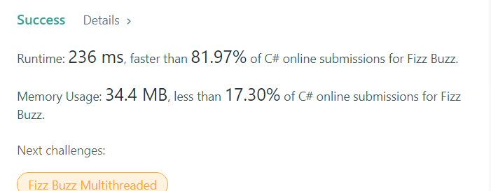

# C# - 100 days of code

## Day40 [LeetCode-#1154] Day of the Year

#### Purpose
> Return the day number of the year

#### Topics
> String

#### Skill
> Convert string to DateTime, 
> Calculate the day of the year

#### Step by Step
1. Convert String to DateTime
2. Calculate the day of year

#### Code
    public class Solution {
        public int DayOfYear(string date) 
        {
            DateTime d = DateTime.Parse(date);
            return d.DayOfYear;
        }
    }

## Success
  

## Day39 [LeetCode-#155] Min Stack

#### Purpose
> Design a stack that supports push, pop, top, and retrieving the minimum element in constant time.

#### Topics
> Stack

#### Skill
>

#### Step by Step

#### Code
    public class MinStack {

        Stack<int> minStack = new Stack<int>();
        Stack<int> stack = new Stack<int>();

        /** initialize your data structure here. */
        public MinStack() {

        }

        public void Push(int x) {
            stack.Push(x);

            if (!minStack.Any()) {
                minStack.Push(x);
            } else {
                if (minStack.Peek() >= x) {
                    minStack.Push(x);
                }
            }
        }

        public void Pop() {
            var x = stack.Pop();
            if (minStack.Peek() == x) {
                minStack.Pop();
            }
        }

        public int Top() {
            return stack.Peek();
        }

        public int GetMin() {
            return minStack.Peek();
        }
    }

## Success
   

## Day38 [LeetCode-#20] Valid Parentheses

#### Purpose
> Program to determine if the input string is valid or not

#### Topics
> String, Stack

#### Skill
> Check if Stack is empty.

#### Step by Step

#### Code
    public bool IsValid(string s) {
        Stack<char> sign = new Stack<char>();
        if (String.IsNullOrEmpty(s))
        {
            return true;
        }
        foreach (var item in s.ToCharArray())
        {
            if(sign.Count() == 0){
                sign.Push(item);
            }else{
                if (sign.Peek() == '('){
                    if(item == ')'){
                        sign.Pop();
                    }else{
                        sign.Push(item);
                    }
                }else if(sign.Peek() == '['){
                    if(item == ']'){
                        sign.Pop();
                    }else{
                        sign.Push(item);
                    }
                }else if(sign.Peek() == '{'){
                    if(item == '}'){
                        sign.Pop();
                    }else{
                        sign.Push(item);
                    }
                }
            }
        }
        return sign.Count == 0;
    }

## Success

##  Day37 [LeetCode-#415] Add Strings

#### Purpose
> Return the sum of num1 and num2

#### Topics
>String

#### Skill

#### Step by Step

#### Code
     public string AddStrings(string num1, string num2) {
        char[] output = new char[Math.Max(num1.Length, num2.Length) + 1];
        bool carry = false;
        int position = 0;

        for (int first = num1.Length - 1, second = num2.Length - 1; first >= 0 || second >= 0; first--, second--){

            int result = (first >= 0 ? num1[first] - '0' : 0) + (second >= 0 ? num2[second] - '0' : 0) + (carry ? 1 : 0);
            carry = result >= 10;
            output[(output.Length - 1) - position++] = (char)('0' + (result % 10));
        }

        if (carry){
            output[0] = '1';
        }

        return new string(
            output, 
            carry ? 0 : 1, 
            carry ? output.Length : output.Length - 1
        );
    }

## Day36. [LeetCode-#412] Fizz Buzz

#### Purpose
> Find the Fizz, Buzz, and FizzBuzz

#### Topics
>Math

#### Skill

#### Step by Step
1. Create a new List
2. for loop through n
3. if for multiples of three, output Fizz
4. if for multiples of five, output Buzz,
5. if for multiples of three and multiples of five, output FizzBuzz

#### Code
    public IList<string> FizzBuzz(int n) {
        List<string> res = new List<string>();
        for(int i = 1; i <= n; i++)
        {
            string str = "";
            if(i % 3 == 0)
                str = "Fizz";
            if(i % 5 == 0)
                str = str + "Buzz";
            
            str = str == ""? i.ToString() : str;
            res.Add(str);
        }
        
        return res;
    }

#### Success

## Day35. [ASP.NET Core] Craete a custom login page in ASP.NET Core MVC (2)

#### Purpose
> Create a custome Login page in ASP.NET Core MVC 

#### .Net Templae
> ASP.NET Core Web app (MVC)

#### Step by Step
  * Update Startup.cs
  > services.addRazorPages();
  > app.UseAuthentication();
  > endpoints.MapRazorPages();

  * Change font

  * Add connection string
  >appsettings.json

  * Add-Migration
  > Add-Migration "Initial-Create"
  > Update-Databas

#### OverView

## Day34. [ASP.NET Core] Craete a custom login page in ASP.NET Core MVC (1)

#### Purpose
> Create a custome Login page in ASP.NET Core MVC 

#### .Net Templae
> ASP.NET Core Web app (MVC)

#### Step by Step
1. Create a default Asp.net core MVC project
2. Create a Customize one
  * No authentication

3. Customize application
  * Add New Scaffolded Identity
    1. Select existing layout 
    > Views\Shared\_Layout.cshtml

    2. Choose file to override
    > Account\Login, 
    >  Account\Register
    
    3. Add Data Context:
    > Auth.System.Data.AuthDbContext

    4. Add User Class
    > ApplicationUser
    
    5. Update Startup.cs

#### OverView

## Day33. EPUB to PDF

#### Purpose
> Convert EPUB to PDF

#### .Net Templae
*Console App*

#### Step by Step
1. Install Nuget pacakge
2. Load input EPUB file
3. Create a instance of PdfSaveOptions
4. call the ConvertEPUB method

#### Code
    var epub = System.IO.File.OpenRead(dataDir + fileName);
    Aspose.Html.Saving.PdfSaveOptions pdfOption = new Aspose.Html.Saving.PdfSaveOptions();
    Aspose.Html.Converters.Converter.ConvertEPUB(epub, pdfOption, dataDir + "EPUBtoPDF.pdf");

#### Overview

## Day32. [LeetCode-#1512] Number of Good Pairs

#### Purpose
>Find the number of Good pairts.

#### Topics
Array

#### Skill
> Nested for loop,
> if 

#### Step by Step
1. Iterate through Nested for loop
2. if nums[i] == nums[j]  &&  i < j, good pairs add 1

#### Code
    public class Solution {
        public int NumIdenticalPairs(int[] nums) {
            int count = 0;
            for(int i = 0; i < nums.Length -1; i++)
            {
                for(int j = 1; j < nums.Length; j++)
                {
                    if(nums[i] == nums[j] && i < j)
                    {
                        count += 1;
                    }
                }
            }
            return(count);          
        }
    }

#### Success

## Day31. [LeetCode-#1470] Shuffle the Array

#### Purpose
>Return the array in the form [x1,y1,x2,y2,...,xn,yn]

#### Topics
Array

#### Skill

#### Code
    public class Solution {
        public int[] Shuffle(int[] nums, int n) {

            if(nums.Length == 0)
                return nums;

            int[] newArray = new int[2 * n];
            int index1 = 0, index2 = n;

            for(int i = 0; i < 2 * n; i++)
            {
                if(i % 2 == 0)
                    newArray[i] = nums[index1++];
                else
                    newArray[i] = nums[index2++];
            }

            return newArray;
        }
    }

#### Success

## Day30, [LeetCode-#1672] Richest Customer Wealth
一行, 解決。

#### Purpose
>Return the wealth that the richest customer has

#### Topic
*Array*

#### Code
    public class Solution {
        public int MaximumWealth(int[][] accounts) {
            return accounts.Max(x => x.Sum());
        }
    }

#### Success

## Day29. [LeetCode-#1243]Array Transformation
今天要別注意在的是在建立新的 Array 時要使用 Clone() 方法

#### Topic
Array

#### Code
    public class Solution {
        public IList<int> TransformArray(int[] arr) {

            // 判斷是否需要建立新的 Array
            int number = -1;
            while (number < 0)
            {
                // 將 arr 的值 Clone 給 newArray
                var newArray = (int[])arr.Clone();
                number = 0;

                // 判斷 newArray 中是否有需要變更的數字
                for (int i = 1; i < arr.Length - 1; i++)
                {
                    if ((newArray[i] < newArray[i - 1]) && (newArray[i] < newArray[i + 1]))
                    {
                        arr[i] = arr[i] + 1;
                        number -= 1;
                    }
                    if ((newArray[i] > newArray[i - 1]) && (newArray[i] > newArray[i + 1]))
                    {
                        arr[i] = arr[i] - 1;
                        number -= 1;
                    }
                }
            }
            return arr;
        }
    }

#### Success

## Day28. [LeetCode-#1480] Running Sum of 1d Array
Simple solution

#### Topic
Array

#### Step by Step
1. For loop through int array
2. nums[i] += nums[i-1];

#### Code
    public class Solution {
        public int[] RunningSum(int[] nums) {
            for(int i = 1; i < nums.Length; i++)
            {
                nums[i] += nums[i-1];
            }
            return nums;
        }
    }

#### Success

## Day27. [LeetCode-#278]. First Bad Version
雖然今天直接參考網友的解法, 但這跟我的原本的想法相同, 直接將 Array 剖半, 再判斷向左或向右查找。 

#### Code
    public int FirstBadVersion(int n) {
            int start = 1, end = n;
            while (start < end) {
                int mid = start + (end-start) / 2;
                if (!IsBadVersion(mid)) start = mid + 1;
                else end = mid;            
            }        
            return start;
        }

#### Success

## Day26. ZIP and Unzip
今天主要實作檔案的壓縮和解壓縮

#### .Net Templae
*Console App*

#### Step by Step

#### Overview

## Day25. Who is your father
今日使用 Console App 執行 OOP 程式

#### .Net Templae
*Console Application*

#### Step by Step
1. 輸入 First name
2. 依據父類別判斷你的 Last name

#### Overview

## Day24. [LeetCode-#137] Single Number II
今日是延續之前的 Single Number II, 主要修改 for loop increament, 而且也還要找出其他更好的方法。

#### Step by Step
1. Sorting array
2. Find the single number

#### Code
    public class Solution {
        public int SingleNumber(int[] nums) {
            // Sorting array
            Array.Sort(nums);

            int n = 0;
            for (int i = 0; i < nums.Length; i+=3)
            {
                if (i == (nums.Length - 1))
                {
                    n = nums[i];
                    return n;
                }
                else
                {
                    // Find the single number
                    if (nums[i] != nums[i + 1])
                    {
                        n = nums[i];
                        return n;
                    }
                }
            }
            return 0;
        }
    }

#### Success

## Day23. [ASP.NET] ASP.NET Identity (2)
結合昨天的部分, 今天完整的使用 ASP.NET Identity 建立登入頁面

#### .Net Templae
*.NET Framework Web Application*

#### Step by Step
9. Create Database and data table
10. Install Microsoft.AspNet.Identity.Owin
11. Install Microsoft.Owin.Host.SystemWeb
12. Add OWIN startup and authentication configuration
13. Add Startup.cs
14. Add a Web Form Login

#### Overview

## Day22. [ASP.NET] ASP.Net Identity (1)
今天只有編寫少部分的 C#, 主要是以學習 ASP.NET Identity 為主。

#### .Net Templae
*.NET Framework Web Application*

#### Step by Step
1. Create A ASP.NET Web Application Empty project
2. Install Nuget package
3. Add a Web Form Register
4. replace content of Register.aspx
5. Add Register.aspx.cs
6. Add App_data
7. Add a connection string in Web.Config
8. Set as Start Page

#### Overview

#### References: [Adding ASP.NET Identity to an Empty or Existing Web Forms Project](https://docs.microsoft.com/en-us/aspnet/identity/overview/getting-started/adding-aspnet-identity-to-an-empty-or-existing-web-forms-project)

## Day21. [LeetCode-#189] Rotate Array
這題要留意的就是使用 Array.Reverse(), 然後分段做 Reverse。只要懂概念, 這題就不難。

#### Step by Step
1. Check if k is zero
2. Use reverse

#### Code
    public void Rotate(int[] nums, int k) 
    {
        // Check if k is zero
        if (k == 0) return;

        k %= nums.Length;

        Array.Reverse(nums);
        Array.Reverse(nums, 0, k );
        Array.Reverse(nums, k, nums.Length - k);
        
    }

#### Success

## Day20. Encrypt PDF and Decrpt PDF Files

#### .Net Core Template:
*Console Application*

#### Step by Step (Encryption)
1. Get project directory
2. Create A instance of Document 
3. Encrypt PDF
4. Save PDF

#### Step by Step (Decryption)
1. Get project directory
2. Create A instance of Document 
3. Decrypt PDF
4. Save PDF

#### Overview

#### Code
    // Encryption
    Document document = new Document(projectDirectory + "/Files/test.pdf");
    document.Encrypt(userPassword, "ownerPassword", 0, CryptoAlgorithm.RC4x128);
    document.Save(projectDirectory + "/Files/EncryptedPDF.pdf");
    // Decryption
    Document document2 = new Document(projectDirectory + "/Files/EncryptedPDF.pdf", userPassword2);
    document2.Decrypt();
    document2.Save("DecryptedPDF.pdf");

#### References: 
1. [Encrypt and Decrypt PDF Files using C#](https://blog.aspose.com/2020/04/28/encrypt-or-decrypt-pdf-files-programmatically-using-csharp-asp.net/)
2. [How do you get the current project directory from C# code when creating a custom MSBuild task?](https://stackoverflow.com/questions/816566/how-do-you-get-the-current-project-directory-from-c-sharp-code-when-creating-a-c)

## Day19. Monitor
今天也是透過著影片學習如何建立效能監控器。只要確實照著步驟做就能順利完成。

#### .Net Core Template:
*Windows Form App*

#### Step by Step
* Add three lables
* Add a timer
* Set the properties
* Using System.Diagnostics
* Create a performanceCounter instance
* Set text value

#### Overview

#### Reference: [How To Make A CPU Monitor in C#](https://www.youtube.com/watch?v=niKP91D50Ko)

## Day18. [LeetCode-#237] Delete Node in Linked List
由於已經先給定了要刪除的 node 不能是 tail node 的先決條件, 所以這題實在有點讓人摸不著頭緒, 如果想的複雜一點反而還可能出錯。:sob:

#### .Net Core Template:
*Console Application*

#### Step by Step
1. Node value is NextNode value
2. Node next is NextNode next 

#### Code
    public void DeleteNode(ListNode node) {
        node.val = node.next.val;
        node.next = node.next.next;
    }

#### Reference: [What is ListNode in C# ?](https://www.reddit.com/r/csharp/comments/f4im6c/what_is_listnode_in_c/)

## Day17. DOCX to HTML
今天使用 Aspose.Words for .NET API, 程式碼的部分也很簡單。 

#### .Net Core Template:
*Console Application*

#### Overview

#### Step by Step
1. Install Nuget package
2. Set Directory path
3. Load DOCX file
4. Initialize HtmlSaveOptions
5. Convert DOCX to HTML

#### Code
    static void Main(string[] args)
    {
        string dataDir = "\\Documents\\C#\\myProject\\100DaysOfCode\\FileConversion\\Files\\";
        // Load the document from disk.
        Document doc = new Document(dataDir + "test.docx");

        // Set HtmlSaveOptions
        HtmlSaveOptions options = new HtmlSaveOptions();
        options.SaveFormat = SaveFormat.Html;

        // Save the document into HTML
        doc.Save(dataDir + "Document.html", options);
    }

#### References
1. [Convert Word DOC or DOCX to HTML, MHTML in C# VB.NET](https://blog.aspose.com/2020/10/02/convert-word-doc-or-docx-to-html-mhtml-csharp-vb-net/)
2. [Aspose.Words 20.12.0 (Nuget)](https://www.nuget.org/packages/Aspose.Words/)
3. [Sample .doc and .docx download](https://file-examples.com/index.php/sample-documents-download/sample-doc-download/)

## Day16. [LeetCode-#670] Maximum Swap
找出轉換後最大的數且只有一次轉換的機會, 那就必須能知道當前的數字是否已經是最大的數。在判斷的過程中如果確認已經找到是最大的數, 則會 Swap two number 並且回傳轉換後的值。

#### Step by Step
1. Convert integer to string
2. Convert string to char array
3. Check if the length of the array is greater than 1 

#### Code
    public int MaximumSwap(int num) {
        string s = Convert.ToString(num);
        char[] ch = s.ToCharArray();
        
        if(ch.Length > 1)
        {
            for (int i = 0; i < ch.Length-1; i++)
            {

                if(ch[i] != '9'){
                    int n = i;
                    for(int j = i + 1; j < ch.Length; j++)
                    {
                        if(ch[i] < ch[j] && ch[j] >= ch[n])
                        {
                            n = j;
                        }

                    }
                    if(n != i)
                    {
                        char[] ch1 = new char[1];
                        ch1[0] = ch[i];
                        ch[i] = ch[n];
                        ch[n] = ch1[0];

                        goto end;
                    }
                }
            }
            end:
            string s2 = new string(ch);
            int parsed = Convert.ToInt32(s2);
            return parsed;

        }
        else
        {
            return num;
        }
    }

## Day15. [LeetCode-#344] Reverse String
即使這題只要使用 Array.Reverse 方法就能夠很輕易地解決, 我還是有想出自己的解法。 我的方式是使用 Swap two nubmers 結合 for loop 做左右互換, 而 for loop 只要執行 array s 長度的一半即可。 

#### Step by Step
1. Declare a one-dimensional char array c
2. Reverse the char array s using for loop (half of array)

#### Code
    public void ReverseString(char[] s) {
        char[] c = new char[1];
        for (int i = 0; i < (s.Length) / 2; i++)
        {
            c[0] = s[i];
            s[i] = s[s.Length - 1 - i];
            s[s.Length - 1 - i] = c[0];
        }
    }

#### Reference: [Array.Reverse Method](https://docs.microsoft.com/en-us/dotnet/api/system.array.reverse?view=net-5.0)

## Day14. [LeetCode-#1323] Maximum 69 Number
由左至右, 將發現的第一個 6 替換成 9, 結束。 

#### Success :tada::tada::tada::tada::tada:
 

#### Step by Step
1. Convert integer to char array
2. Find and place digit 6 to 9
3. Convert char array to string
4. Convert string to integer

#### Code
    public class Solution {
        public int Maximum69Number (int num) {
            char[] arr = num.ToString().ToCharArray();
            for (int i=0; i < arr.Length; i++)
            {
                if (arr[i] == '6')
                {
                    arr[i] = '9';
                    break;
                }
            }
            string str = new string(arr);
            int x = Int32.Parse(str);
            return x;
        }
    }

## Day13. [LeetCode-#136, #287] Single Number, Find the Duplicate Number
今天這兩題的作法都是先將陣列進行排序, 在判斷是否和下一位數相同或是相異。如果能找出 Single Number, 那一定也能找出 Duplicate Number。

#### Step by Step (#136)
1. Sorting array
2. Find the single number

#### Code(#136)
    public int SingleNumber(int[] nums) {
        // Sorting array
        Array.Sort(nums);

        for (int i = 0; i < nums.Length; i++)
        {
            if (i == ( nums.Length - 1))
            {
                return nums[i];
            }
            else
            {
                // Find the single number
                if (nums[i] != nums[i + 1] && ((i + 1) % 2) == 1)
                {
                    return nums[i];
                }
            }
        }
        return 1;
            
    }

#### Reference: 
1. [Different ways to sort an array in descending order in C#](https://www.geeksforgeeks.org/different-ways-to-sort-an-array-in-descending-order-in-c-sharp/#:~:text=Method%201%3A%20Using%20Array.Sort,and%20Array.Reverse()%20Method&text=Sort()%20method%20which%20sorts,Reverse()%20method.&text=int%20%5B%5D%20arr%20%3D%20new%20int,Sort%20array%20in%20ascending%20order.)

2. [What is the difference between & and && operators in C#
](https://stackoverflow.com/questions/4163483/what-is-the-difference-between-and-operators-in-c-sharp)

## Day12. [LeetCode-#709, #190] To Lower Case, Reverse Bits
第一題算是非常簡單的題目, 只需要使用.ToLower() 就能完成。
第二題則複雜很多, 第一步會先將 Unsigned integer 轉換成一個 Binary string, 再使用 PadLeft() 以 '0' 填充 Binary string 左邊空格的部分, 填充後再將這個 Binary string 轉換成一個 char array。 當然, 這題最主要的還是要進行 Reverse bits, 最後使用了一個 for loop 結合 swap 的方式進行轉換。

#### Step by Step (#190)
1. Convert uint to binary string
2. Pad the  binary string with leading zeros
3. Convert to char array
4. Reverse bits

#### Code(#190)
    public uint reverseBits(uint n) {
        string binary = Convert.ToString(n, 2);
        char[] ch = binary.PadLeft(32, '0').ToCharArray();
        char[] c = new char[1];
        for (int i=0; i < 16; i++)                         // 左右互換
        {
            c[0] = ch[i];
            ch[i] = ch[31-i];
            ch[31-i] = c[0];
        }
        string s = new string(ch);
        uint parsed = Convert.ToUInt32(s, 2);
        return parsed;
    }

## Day11. [LeetCode-#1] Two Sum
這題算是蠻簡單的, 只要使用兩個 for loop 就能找出組成 target 的兩個數。

#### Code:
    public static int[] TwoSum(int[] nums, int target)
    {
        for (int i = nums.Length - 1; i >= 0; i--)
        {
            for (int j = 0; j <= i - 1; j++)
            {
                if (nums[j] + nums[i] == target)
                {
                    int[] num = { j, i };
                    return num;
                }
            }

        }
        return null;
    }

## Day10. [LeetCode-#191] Number of 1 Bits

#### Step by Step
1. Convert uint to string
2. Convert string to char array
3. Foreach char array and count the number of 1s

#### Code:
    public int HammingWeight(uint n) 
    {
        string s = Convert.ToString(n, 2); // Convert uint ot string
        char[] ch = s.ToCharArray();       // Convert string to char array
        int num = 0;              
        foreach (char c in ch)             // Foreach char array and count the number of 1s
        {
            if(c == '1')
            {
                num = num + 1;
            }
        }
        return num;
    }

## Day9. Windows Form CRUD Operations (2)
延續昨天未完的部分

## Day8. Windows Form CRUD Operations (1)
今日參考 Youtube 上的教學影片建立 Windows Form App, 主要功能是對於 SQL Server 的資料進行 CRUD Operations, 未完的部分明天繼續

#### .Net Core Template:
*Windows Form App*

#### Step by Step

#### Features

#### Code

#### References:  
1. [C# and SQL Server Perform SMART CRUD Operations with SEARCH (Edited Version Part 1/2)](https://www.youtube.com/watch?v=mw4TmD2AMtA)
2. [C# and SQL Server Perform SMART CRUD Operations with SEARCH (Edited Version Part 2/2)](https://www.youtube.com/watch?v=iqT0e09JCXQ)

## Day7. Digital Clock

#### Step by Step
* Download DS-Digital font
* Create Windows Form app
* Change background
* Add Labels
* Add button
* Change font
* Coding
#### Code
    private void timer1_Tick(object sender, EventArgs e)
    {
        <!-- Formatting times -->
        label1.Text = DateTime.Now.ToString("dddd");
        label2.Text = DateTime.Now.ToString("HH:mm");
        label5.Text = DateTime.Now.ToString("tt");
        label4.Text = DateTime.Now.ToString("yyyy");
        label3.Text = DateTime.Now.ToString("ss");
        label6.Text = DateTime.Now.ToString("MMM:dd");

    }
    private void Form1_Load(object sender, EventArgs e)
    {
        <!-- start a timer -->
        timer1.Start();
    }
    private void button1_Click(object sender, EventArgs e)
    {
        <!-- Exit the application -->
        Application.Exit();
    }

#### Referencee: [Make Digital Clock using C# Visual studio basics](https://www.youtube.com/watch?v=OFQxQndIFrQ)

## Day6. Multiplication table
參考網路資料後加入了標題以及輸入功能

#### Reference: [Multiplication tables](https://rosettacode.org/wiki/Multiplication_tables)

## Day5. DBConnection
SQL Server 連線測試程式。

#### Reference:
1. [Beginners guide to accessing SQL Server through C#](https://www.codeproject.com/Articles/4416/Beginners-guide-to-accessing-SQL-Server-through-C))
2. [How to check MySQL connection state in C#](https://stackoverflow.com/questions/20785220/how-to-check-mysql-connection-state-in-c-sharp/20785451)

## Day4. Elementary Arithmetic
簡易四則運算

## Day3. Signature pad (1)
參考網路文章建立簽名板, 因為程式中有些地方還需要進行除錯。

#### Reference: [Register Account with Digital Signature in ASP.NET Core MVC](https://www.youtube.com/watch?v=NUrpve7hXuM)

## Day2. Upload files and save in database
今天參考的是這篇 [How to Upload Files and Save in Database in ASP.NET Core MVC](https://tutexchange.com/how-to-upload-files-and-save-in-database-in-asp-net-core-mvc/), 文章寫得非常詳細, 只要按照他的步驟就能夠成功將檔案存入資料庫中。

#### .Net Core Template
*Windows Form*

#### Overview

## Day1. File management
第一天, 今天參考 Tim Corey 的影片 [Working With The File System in C# - Managing Folders and Files](https://www.youtube.com/watch?v=9mUuJIKq40M), 學習如何對檔案進行存取。主要使用到 System.IO 的 [Directory](https://docs.microsoft.com/en-us/dotnet/api/system.io.directory?view=net-5.0) 類別。

#### .Net Core Template
*Console Application*

#### Overview

